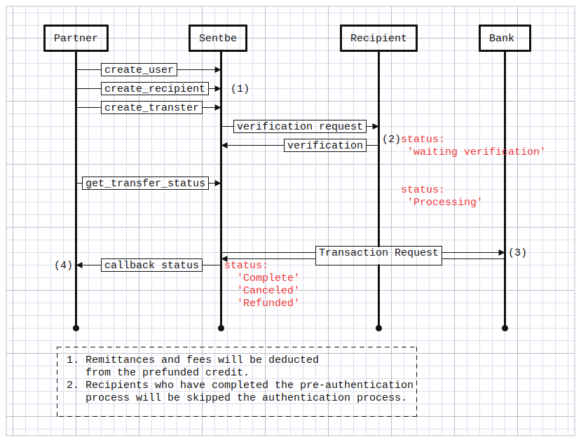

# Introduction

TODO: inbound service 소개글 작성  
Welcome to the Sentbe API! You can use our API to access Sentbe API endpoints, which can get information on remittance.

We have language bindings in Shell, Ruby, and PHP! You can view code examples in the dark area to the right, and you can switch the programming language of the examples with the tabs in the top right.

<!-- This example API documentation page was created with [Slate](https://github.com/lord/slate). Feel free to edit it and use it as a base for your own API's documentation. -->

# Getting Started
TODO: 송금 방식에 대한 설명

